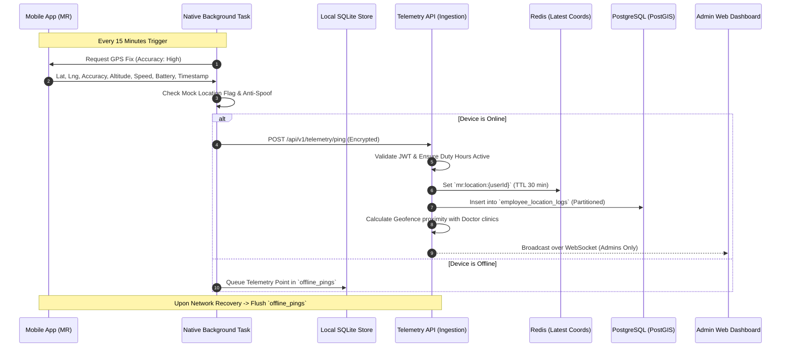

# Architecture & Technical Blueprint
## NextGen Pharma Sales Force Automation (SFA) & Telemetry Platform

---

### 1. High-Level System Architecture

```
+-----------------------------------------------------------------------------------+
|                                CLIENT APPLICATIONS                                |
|                                                                                   |
|  +-------------------------------------+   +------------------------------------+ |
|  |     Mobile Field App (React Native) |   |   Admin & Management Web Portal    | |
|  |   - Field MRs & Area Managers       |   |   - Super Admins, Sales Directors  | |
|  |   - 15-Min Background Location Task |   |   - Live Fleet Map & Route Replay  | |
|  |   - Offline-First Sync Engine       |   |   - Master Data & MIS Analytics    | |
|  +-------------------------------------+   +------------------------------------+ |
+-----------------------------------------------------------------------------------+
                                         |
                                         | (HTTPS / WSS via TLS 1.3)
                                         v
+-----------------------------------------------------------------------------------+
|                              API GATEWAY & SECURITY LAYER                         |
|   - Rate Limiting & DDOS Protection                                               |
|   - JWT Authentication & RBAC Guard (Admin vs Manager vs MR)                      |
|   - Telemetry Ingestion Buffer & Validation                                       |
+-----------------------------------------------------------------------------------+
                                         |
        +--------------------------------+--------------------------------+
        |                                                                 |
        v                                                                 v
+------------------------------------+           +----------------------------------+
|      APPLICATION SERVICES (API)    |           |   TELEMETRY & INGESTION ENGINE   |
|  - Auth & User Service             |           |  - 15-Min Periodic Ping Receiver |
|  - Master Data (Doctors/Chemists)  |           |  - Anti-Spoofing & Geofencing    |
|  - Tour Planning & DCR Engine      |           |  - Route Deviation Processor     |
|  - Orders (POB) & RCPA Service     |           |  - WebSocket Live Broadcaster    |
|  - HRMS & Expense Processing       |           |                                  |
+------------------------------------+           +----------------------------------+
        |                                                                 |
        +--------------------------------+--------------------------------+
                                         |
                                         v
+-----------------------------------------------------------------------------------+
|                                DATA & CACHING LAYER                               |
|                                                                                   |
|  +----------------------------------+          +--------------------------------+ |
|  | PostgreSQL with PostGIS          |          | Redis 7.x (Cache & Pub/Sub)    | |
|  | - Spatial Doctor Clinic Geofences|          | - Live Location Caching (TTL)  | |
|  | - Relational Business Records    |          | - WebSocket Session Broker     | |
|  | - Partitioned Location Logs Table|          | - Telemetry Throttling Queues  | |
|  +----------------------------------+          +--------------------------------+ |
|                                                                                   |
|  +------------------------------------------------------------------------------+ |
|  | AWS S3 / Cloudflare R2 / MinIO (Object Storage)                              | |
|  | - Medical E-Detailing Media, Expense Receipts, DCR Doctor Signatures          | |
|  +------------------------------------------------------------------------------+ |
+-----------------------------------------------------------------------------------+
```

---

### 2. Technology Stack Selection

| Layer | Recommended Technology | Rationale |
|---|---|---|
| **Mobile App (Field MR)** | **React Native + Expo SDK (TypeScript)** | Cross-platform (iOS/Android), native background location support (`expo-task-manager`, `expo-location`), seamless offline caching (`WatermelonDB` / `SQLite` / `TanStack Query`). |
| **Admin Web Portal** | **React 19 + Vite + TypeScript + Tailwind CSS** | High-performance dashboard with instant load times, modular component architecture, rich mapping integration (`Leaflet` / `Mapbox GL` / `OpenLayers`). |
| **Backend API & Telemetry** | **Node.js (NestJS / Express) OR Python (FastAPI)** | High throughput, asynchronous I/O, robust TypeScript/Python types, native WebSockets support for real-time admin monitoring. |
| **Primary Database** | **PostgreSQL 16+ with PostGIS Extension** | Enterprise ACID compliance, robust geospatial queries (`ST_DWithin`, `ST_Point`, `ST_Distance`) for doctor geofencing and territory polygon boundaries. |
| **In-Memory Cache & Pub/Sub** | **Redis 7.x** | Fast in-memory caching of the latest known coordinates of all field staff, pub/sub for real-time WebSocket map broadcasts. |
| **Object Storage** | **S3-Compatible Storage (AWS S3 / MinIO / R2)** | Secure, scalable storage for expense receipts, doctor visual aids, and attendance selfies. |

---

### 3. Background 15-Minute Location Architecture



---

### 4. Database Schema Design (Core Entities)

#### 4.1. Role-Based Access Control & Users (`users`, `roles`)
* `id` (UUID, Primary Key)
* `email` (String, Unique)
* `password_hash` (String)
* `role` (Enum: `SUPER_ADMIN`, `REGIONAL_MANAGER`, `AREA_MANAGER`, `MEDICAL_REP`)
* `territory_id` (UUID, Foreign Key)
* `is_active` (Boolean)

#### 4.2. Location Telemetry Table (`employee_location_logs`)
*Partitioned by month for optimal query speed on large datasets.*
* `id` (BigInt, PK)
* `user_id` (UUID, FK -> users)
* `location` (`GEOMETRY(Point, 4326)`) — PostGIS Spatial Point (Lat/Lng)
* `accuracy_meters` (Float)
* `speed_kmh` (Float)
* `battery_percentage` (SmallInt)
* `is_mock_location` (Boolean)
* `is_charging` (Boolean)
* `captured_at` (Timestamp with Timezone)
* `created_at` (Timestamp with Timezone)

#### 4.3. Master Data: Doctors & Chemists (`doctors`, `chemists`)
* `id` (UUID, PK)
* `name` (String)
* `qualification` (String)
* `specialization` (String, e.g. Cardiology, Orthopedic, Pediatric)
* `tier` (Enum: `A_PLUS`, `A`, `B`, `C`)
* `clinic_name` (String)
* `clinic_location` (`GEOMETRY(Point, 4326)`) — PostGIS coordinates
* `geofence_radius_meters` (Int, Default 100m)
* `territory_id` (UUID, FK)

#### 4.4. Tour Plan & DCR (`tour_plans`, `dcr_records`)
* `id` (UUID, PK)
* `user_id` (UUID, FK)
* `visit_date` (Date)
* `doctor_id` (UUID, FK)
* `status` (Enum: `PLANNED`, `COMPLETED`, `MISSED`, `UNPLANNED`)
* `products_detailed` (JSONB Array of product IDs)
* `samples_given` (JSONB Array)
* `pob_amount` (Decimal)
* `doctor_signature_url` (String)
* `is_geofence_verified` (Boolean)
* `checkin_location` (`GEOMETRY(Point, 4326)`)

---

### 5. Repository & Folder Structure

```
pappu-da-company/
├── apps/
│   ├── mobile/                    # React Native / Expo Mobile App (MR / Field Staff)
│   │   ├── app/                   # Expo Router File-based Navigation
│   │   │   ├── (auth)/            # Login, Forgot Password, Activation
│   │   │   ├── (tabs)/            # Main Tabs (Home, Tour Plan, DCR, Orders, Profile)
│   │   │   ├── doctor/[id].tsx    # Doctor Profile & Visit Details
│   │   │   ├── dcr/new.tsx        # New DCR Entry Form with Offline Support
│   │   │   └── edetailing/        # Digital Visual Aid Presentation Screen
│   │   ├── src/
│   │   │   ├── components/        # Reusable Mobile UI Components (Cards, Badges, Inputs)
│   │   │   ├── features/          # Feature Modules (DCR, Orders, Attendance, TourPlan)
│   │   │   ├── services/
│   │   │   │   ├── background/    # 15-Minute Background Location Task Manager
│   │   │   │   ├── offline/       # SQLite / WatermelonDB Local Database & Sync
│   │   │   │   └── api/           # Axios/Fetch API Clients
│   │   │   └── store/             # Zustand State Stores (Auth, SyncQueue)
│   │   └── app.json
│   │
│   ├── web-admin/                 # React 19 / Vite Web Admin Portal
│   │   ├── src/
│   │   │   ├── assets/            # Icons, Logos, Styling Assets
│   │   │   ├── components/
│   │   │   │   ├── maps/          # Live Tracking Map, Route Replay, Geofence Editor
│   │   │   │   ├── ui/            # Buttons, Modals, DataTables, FilterBars
│   │   │   │   └── layout/        # Sidebar, Header, Breadcrumbs
│   │   │   ├── pages/
│   │   │   │   ├── dashboard/     # High-Level KPI & Executive Overview
│   │   │   │   ├── fleet/         # [ADMIN ONLY] Live Employee Location Tracking Map
│   │   │   │   ├── history/       # [ADMIN ONLY] Historical Route & Deviation Playback
│   │   │   │   ├── doctors/       # Doctor Directory, Geotag Management
│   │   │   │   ├── dcr/           # DCR Verification & Report Auditing
│   │   │   │   ├── orders/        # Secondary Sales & POB Approval
│   │   │   │   └── reports/       # MIS, RCPA, and Expense Claim Export
│   │   │   ├── hooks/             # Custom React Hooks (useWebSocket, useAuth)
│   │   │   └── services/          # API Handlers & WebSocket Clients
│   │   └── vite.config.ts
│   │
│   └── server/                    # Node.js / Express or NestJS Backend
│       ├── src/
│       │   ├── modules/
│       │   │   ├── auth/          # JWT, Refresh Tokens, RBAC Guards
│       │   │   ├── telemetry/     # [ADMIN RESTRICTED] Location Ping Ingestion & WebSocket
│       │   │   ├── doctors/       # Doctor Master CRUD & Geocoding
│       │   │   ├── dcr/           # Daily Call Reporting & Geofence Verification
│       │   │   ├── orders/        # POB, Chemist Auditing, Stockist Management
│       │   │   ├── hrms/          # Attendance, Expenses, Leave Management
│       │   │   └── reports/       # Analytics, Export (CSV/PDF)
│       │   ├── common/
│       │   │   ├── guards/        # RolesGuard, AdminOnlyGuard
│       │   │   ├── filters/       # Global Error & Exception Filters
│       │   │   └── interceptors/  # Logging & Audit Interceptors
│       │   └── database/          # Prisma / Drizzle / TypeORM PostGIS Schemas & Migrations
│       └── package.json
```
