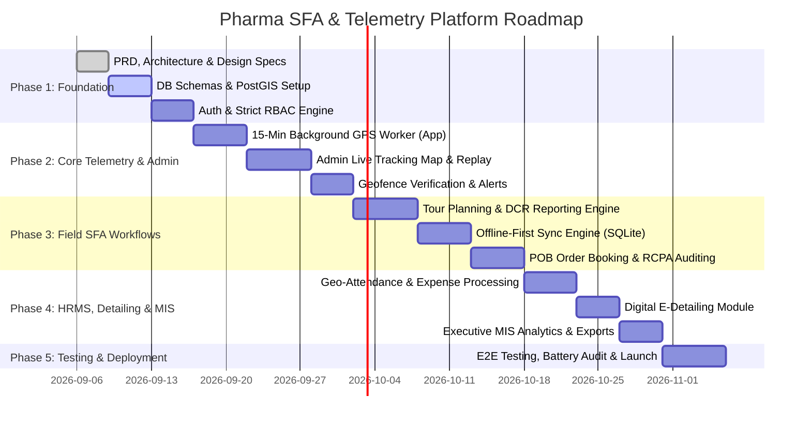

# Project Phases & Implementation Roadmap

---

---

### Phase 1: Core Foundation, Authentication & Master Data (Week 1–2)
* **Deliverables**:
  * Set up Monorepo / structured workspaces (Mobile App, Web Admin Portal, Backend API).
  * Configure PostgreSQL database with PostGIS extensions and run migration scripts.
  * Build Authentication & Role-Based Access Control (RBAC) supporting Super Admin, Regional Manager, and Field MR.
  * Master Data CRUD APIs: Doctors (with geo-coordinates), Chemists, Stockists, Products, and Territory Polygons.

### Phase 2: 15-Minute Background Telemetry & Admin Live Map (Week 3–4)
* **Deliverables**:
  * Implement Expo TaskManager / Android Foreground Service for automated 15-minute location telemetry logging.
  * Anti-mocking and battery-optimized GPS acquisition module.
  * Telemetry ingestion endpoint with Redis caching and PostGIS historical logging.
  * **Admin Fleet Map Dashboard**: Real-time map displaying field reps, interactive route breadcrumbs, idle times, and route deviation warnings.

### Phase 3: Field MR Operations & Offline-First Sync (Week 5–6)
* **Deliverables**:
  * Mobile Tour Planning (TP) weekly/monthly scheduler with manager approval flow.
  * Daily Call Report (DCR) logging with doctor selection, product discussion, and sample tracking.
  * Doctor Clinic Geofence Verification (validates if MR is within 100m when submitting DCR).
  * Product Order Booking (POB) and Retail Chemist Prescription Audit (RCPA) forms.
  * Offline-first local database queue with background synchronization upon network reconnection.

### Phase 4: HRMS, Expense Management, E-Detailing & MIS (Week 7–8)
* **Deliverables**:
  * Geo-attendance punch-in / punch-out with selfie capture.
  * Travel & Expense claim system with verified GPS distance calculation and receipt image upload.
  * Digital E-Detailing slide viewer with per-slide time tracking analytics.
  * Admin MIS reporting suite: Doctor call coverage %, sales conversion rates, POB order export (Excel/PDF).

### Phase 5: Verification, Battery Life Optimization & Production Launch (Week 9)
* **Deliverables**:
  * Real-world field testing of 15-minute background location service across Android & iOS devices (evaluating battery drain `< 5%`).
  * End-to-end security audit of location telemetry access controls (ensuring zero data leakage to non-admins).
  * Production deployment of backend (Docker/Kubernetes), Admin Web Portal (CDN/Vercel/Cloudflare), and Mobile App bundle builds.
